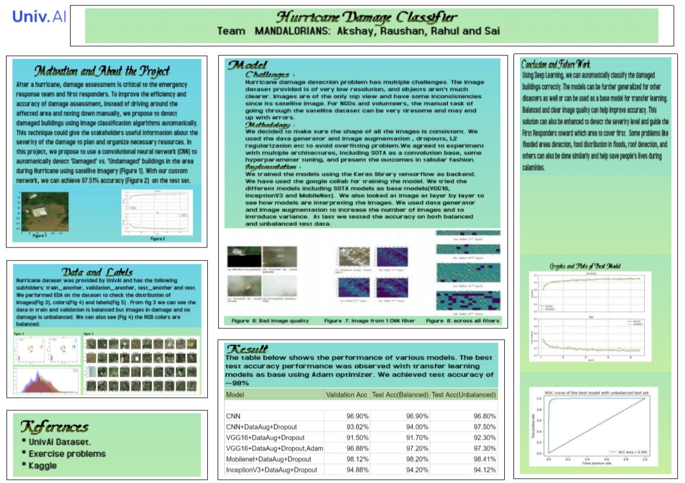

# Damagedetection
Problem Description and approach:
* The problem statement is to assess damage post hurricane.
* We have labelled satellite images of building of different sizes and quality.
* We need to classify building using ML model to correctly identify damaged building.

Solution Approach:
* Given image data we need to clean them and reshape the size for optimal computation.
* We have used  CNN to create  model and also experimented with diferent hyperparameters, optimizers and looked at how network is learning.
* Having different SOTA models and with clean data we have created model which actually provided ~98% accuracy on test dataset(balanced and unbalanced).

 
 
Google colab link: https://colab.research.google.com/drive/1vjdGUrcg7o2xY2tkyyBoUZsI6z1LGD6w

Poster link: https://drive.google.com/file/d/1rJO5vTbaT3b58qxqWwrVO2lLg_mJcICc/view?usp=sharing

Short presentation recording: https://drive.google.com/file/d/1FekHrWermXM8hhBBnjuCIjjx8cImkskF/view

PPT Link: https://drive.google.com/file/d/1rTgxTP-Bureoaf9vqjs0Q3Tx_uEfpoKc/view?usp=sharing
